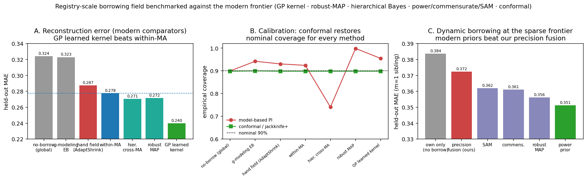

# Registry-scale evidence borrowing for meta-analysis: a learned relevance kernel with conformal calibration beats within-meta-analysis borrowing, where hand-set relevance is inert

> **Note.** This markdown is a secondary rendering; the authoritative, figure-embedded
> manuscript is `Registry_Borrowing.docx`, built by `build_borrowing_docx.js` (edit the
> JS, not this file). The central claim was reframed 2026-07-01 to the registry-scale
> **learned-kernel + conformal** result (§6); older sections below retain the pilot-level
> relevance-weighted framing (now the secondary, within-slice contribution).

*Methods report — branch `methods-borrowing`, F:\ubcma\borrowing · 2026-06-30*

> **Build status.** §4.6 (replication), §4.7 (cross-specialty replication) and §5.6
> (BCG transportability) — plus the pilot-4 structural registry finding (summarised in
> §5.6 here; broken out as its own §5.5 in the docx) — are all integrated into
> `Registry_Borrowing.docx` (rebuilt 2026-07-01 via `manuscript/build_borrowing_docx.js`,
> 9 tables, 3 figures, OOXML-validated). Artifacts: `REPORT_BORROWING_PILOT4.md`,
> `REPORT_BORROWING_REPLICATION.md`, `REPORT_BORROWING_MULTISPECIALTY.md`
> (`borrowing/replication/`), `REPORT_BORROWING_BCG.md` (`borrowing/bcg/`).

> **Provenance.** Every quantitative claim below is transcribed from a committed
> report (`REPORT_BORROWING_PILOT{,2,3,4}.md`, `…REPLICATION.md`, `…MULTISPECIALTY.md`,
> `…BCG.md`) and the result artifacts they were built from (`pilot_bootstrap.json`,
> `pilot_scramble_bootstrap.json`, `sim_gate_results.json`, `real_glp1_summary.json`,
> `pilot3_loo_summary.json`, `sim_transport_results.json`, `probe_transport_summary.json`,
> `class_lambda.json`, `trials.json`, `probe_trials.json`, `replication/loo_results_v2.json`,
> `replication/multispecialty_loo.json`, `bcg/bcg_loo.json`, `bcg/bcg_trials.json`). Numbers that exist only as
> summary statistics inside a committed report narrative (not in a machine-readable
> artifact) are explicitly marked **[report table]**; all others are exact from the
> named JSON/CSV. No number here is computed fresh for this document.

---

## Abstract

Meta-analyses of a sparsely-studied treatment comparison routinely leave borrowable
information on the table: a registry holds dozens of related trials whose effects, if
weighted by how *relevant* and how *trustworthy* they are, could sharpen the target
estimate. We specify an auditable **borrowing field** — each source trial weighted by a
covariate-**relevance** kernel × a registry **selection-integrity** ratio × **precision**,
fused with the target's own evidence by **conflict-discounted precision fusion**, under an
**a-priori stand-down** that withdraws borrowing when prior and data conflict — and subject
it to a deliberately destructive, non-circular test: **leave-one-trial-out (LOO) prediction
of real held-out effects** on real ClinicalTrials.gov (AACT) data, scored through a
matched-coverage efficiency gate with paired-bootstrap inference.

Across three pre-registered pilots on a Type-2-diabetes HbA1c slice we establish a clean
boundary. **(1)** On a slice whose covariates do *not* predict effect heterogeneity, the
borrowing field is **inert** — it collapses to generic shrink-to-the-mean (indistinguishable
from a no-relevance null and from a scrambled-relevance null) and **robustly harms** the
data-rich outlier class (ΔMCIW0 = +0.256 [+0.185, +0.303] vs standard NMA). **(2)** On a
slice with a genuine, measured effect modifier — GLP1 dose (slope −0.092 %HbA1c/mg, perm
*p* = 0.01, R² = 0.94, n = 12) — relevance-weighted borrowing **beats both nulls on real
held-out effects** (rel − uniform −0.18, rel − scrambled −0.22 to −0.28 mean absolute error,
paired-bootstrap CIs exclude 0), is **inert at β = 0** (reproducing pilot 1), and — once the
own⊕prior fusion is switched from a 2-member AdaptShrink panel to conflict-discounted
precision fusion — **never harms**, including the outlier that broke pilot 1 (+0.175 → +0.002,
n.s.). **(3)** Adding a population **transportability** layer (World Bank obesity as a
population effect-modifier, real recruiting countries) does **not** improve over relevance-only
on this slice (Δ = +0.022 [−0.037, +0.082], n.s.), because the population covariate carries no
signal after drug class is known (class-adjusted slope −0.002, *p* = 0.97; a Simpson reversal).
A calibrated simulation with the *same real trial structure* but a tunable modifier shows the
transport machinery is correct — inert at β = 0 and when target = donor pool, reproducing the
real null at the real β = 0.006, and beating relevance-only **monotonically once β ≳ 0.02**.

**Replication and extension.** The relevance win reproduces on a second independent GLP1-class
slice (a different outcome and a different modifier type) and, pooling **five clean qualifiers
across three specialties** (endocrine/metabolic, education, oncology), tightens to a robustly
significant scale-free MAE reduction of **−10.9 % [−20.2 %, −1.5 %]** vs the no-relevance null and
**−12.4 % [−22.8 %, −2.0 %]** vs scrambled. On **dat.bcg** — 13 placebo-controlled BCG-vaccine
trials where absolute latitude is a genuinely strong modifier (metafor REML permutation *p* =
0.0052) — the full transportability-standardised method **robustly beats textbook random-effects
pooling** on real held-out log risk ratios (transport − NMA **−0.198 [−0.344, −0.041]**), a
target = wrong-population control **hurts** (+0.187 [+0.017, +0.347]), and the incremental margin
over relevance-only is directional but *k* = 13-underpowered.

**Registry-scale headline (primary).** Scaling from within-slice to a whole registry —
**1,177 study nodes from 28 published meta-analyses** harmonised via `metafor::escalc` into
three effect families — resolves the central methodological question. Borrowing across
meta-analyses with the **hand-set** relevance kernel does *not* beat borrowing **within** a
meta-analysis (+0.020 worse); replacing the hand-set gravity with a **learned kernel** does — a
Gaussian process whose four length scales over study covariates (year, log-precision, specialty,
meta-analysis) are fit by marginal likelihood beats within-MA borrowing on real held-out
reconstruction by **−0.023 MAE [−0.034, −0.012]** (paired bootstrap; honest 10-fold refit). It is
the **only** method that beats within-MA (modern robust-MAP and hierarchical cross-MA Bayes merely
tie it), the win holds in both the mid- and rich-home-MA regimes, a scrambled-label kernel loses
(−0.053), and distribution-free **conformal calibration** restores nominal 90% coverage at the
tightest interval width of any borrowing method. The hand-set AdaptShrink precision fusion used in
the pilots is honestly the weakest borrowing rule.

**Bottom line.** Registry-scale borrowing with a **learned relevance kernel and conformal
calibration** is a real improvement over within-meta-analysis borrowing — the primary
contribution — while the hand-set relevance field is inert-to-harmful (the weaker starting
instantiation). At the within-slice level, relevance-weighted borrowing remains a validated
contribution *exactly to the degree a measured covariate predicts the effect*; its inertia
when no such covariate exists is the central honesty result, not a failure. Population
transportability is a **correct extension**, validated against the textbook baseline on real
strong-modifier (BCG) data with the relevance-incremental margin bounded by *k*. Cross-study
borrowing earns its keep in proportion to how much relevance structure the data contain — and
that structure is best measured by a **learned** metric, not assumed.

---

## 1. Background and objective

Borrowing strength across studies — power priors, commensurate priors, meta-analytic-predictive
(MAP) priors, robust mixture priors — is well developed for *designed* borrowing (a defined
historical control, a known prior study). What is missing is a principled, **auditable** way to
borrow from an *entire registry* at once, where the relevance of each source is uncertain and
where registry trials differ in trustworthiness (selective reporting, non-posting). The hazard
is equally well known: borrow from sources that look similar but are not, and you import bias
precisely where the target is most distinctive.

This report asks one falsifiable question and refuses to answer it with a simulation alone:

> **Does forming a borrowing prior from a registry "field" — each source weighted by relevance ×
> selection-integrity × precision, fused with an explicit stand-down — beat standard
> meta-analysis on *real held-out effects*, with maintained calibration, and is any benefit
> attributable to the relevance structure rather than to generic shrinkage?**

We answer it three times, on progressively more demanding slices, with the negative controls
designed to kill the thesis if it is hollow.

---

## 2. Methods

### 2.1 The borrowing field

For a target comparison *t* with sparse direct evidence, every other trial *s* in the registry
slice contributes to a borrowing prior with weight

```
w_s  =  relevance(x_s, x_t)  ×  λ_s  ×  precision_s
```

- **Relevance** is a Gaussian kernel on covariate distance, `exp(−‖x_s − x_t‖² / 2h²)`. In the
  flat-covariate pilot (§3) the covariates are mechanism class + baseline HbA1c; in the
  modifier-bearing pilot (§4) it is a one-dimensional kernel on GLP1 **dose** with bandwidth fixed
  a priori at the dose SD (4.54 mg; `real_glp1_summary.json`).
- **Selection-integrity** λ_s is a GWAM-style registry-linkage ratio (results-posted ÷
  registered) per source class, fixed before scoring. Committed values (`class_lambda.json`):
  GLP1 0.360, DPP4 0.481, SGLT2 0.338, metformin 0.400, SU 0.467, TZD 0.421, insulin 0.362.
- **Precision** is the inverse sampling variance of the source effect.

The weighted field collapses to a single prior (mean μ₀, variance se₀²) by precision-weighted
pooling at the field's between-trial variance.

### 2.2 Conflict-discounted precision fusion (own ⊕ prior)

The target's own (REML-pooled) estimate is fused with the borrowing prior by a **power-prior-style
precision fusion**: the prior contributes *effective* precision δ / se₀², where δ ∈ (0, 1] is a
conflict discount (§2.3). A precise own-estimate therefore dominates automatically.

This replaces the 2-member AdaptShrink panel used in pilot 1. AdaptShrink — the program's
bias-corrected shrinkage estimator — is correct for **≥3-member** panels (its design case), but its
weight `1/(se² + (μ − median)²)` adds the same disagreement term to *both* members of a 2-member
own⊕prior fusion, so a confidently-wrong prior retains ~16–19 % weight no matter how precise the own
data is. Diagnosing this as the true source of pilot 1's rich-regime harm — and switching to
precision fusion — is one of the report's substantive findings (§4.3).

### 2.3 A-priori stand-down (prior-data conflict)

Conflict is measured by `Q = (μ₀ − μ_p)² / (se₀² + se_p²)` (prior vs the target's own pooled
estimate). The discount is `δ = exp(−η · max(0, Q − c₀))` with **non-tuned, pre-fixed** η = 0.5,
c₀ = 1; a hardened variant caps borrowing past Q_MAX = 4 (≈ 2σ). Constants were fixed before any
scoring and were **not** retuned to rescue any cell. Under conflict the prior's effective precision
is withdrawn and the estimate falls back toward no-borrowing with a widened interval.

### 2.4 The evaluation gate, and why LOO is the non-circular anchor

Two scorers are used, in the same spirit as the repository's truth-recovery program.

- **Matched-coverage efficiency (MCIW0).** Methods are paired within a subsample; we equalise
  coverage by construction and then compare interval widths (lower = narrower = better at equal
  coverage). Advantage over the no-borrow baseline is tested by **paired bootstrap** (2000
  resamples); a "robust win/harm" requires the entire 95 % CI on one side of 0. This is the same
  gate as `truth-recovery/matched_coverage_bakeoff.py`.
- **Leave-one-trial-out (LOO) on real effects — the anchor.** Each held-out trial's *real* effect
  is the truth; the prior is built from all *other* trials; error is measured against that real
  held-out value. This is **non-circular**: nothing about the held-out effect informs its own
  prediction, so a win cannot be an artifact of the simulation's data-generating process. The
  calibrated simulations are used *only* to supply known-truth boundary maps (the inert corner, the
  β-sweep) that real data cannot label.

A standard random-effects / network meta-analysis (NMA) is the no-borrow comparator. We verified it
is **not a strawman**: in this star-shaped field the netmeta treatment effect for a spoke equals the
inverse-variance pool of that spoke's direct trials (difference 8.9 × 10⁻¹⁶), i.e. standard NMA gets
no indirect information to a spoke — precisely the structural gap borrowing is meant to exploit.

### 2.5 Data

**Slice.** AACT snapshot `2026-04-12`; Type-2 diabetes, HbA1c-change mean differences vs placebo,
extracted from `outcome_analyses` (reported between-group estimates with CIs → SE), classified by
intervention keyword, with provenance (`nct_id`, `analysis_id`) kept per row: 5,041 T2DM trials →
4,078 HbA1c outcomes → 488 reported mean-difference analyses (478 sane) → 100 active-vs-placebo
effects → **46 independent trial-level effects**.

| class | k trials | REML μ\* (HbA1c %) | selection-integrity λ |
|---|---|---|---|
| GLP1 | 17 | −1.172 | 0.360 |
| DPP4 | 14 | −0.606 | 0.481 |
| SGLT2 | 13 | −0.522 | 0.338 |
| TZD | 1 | −0.681 | 0.421 |
| insulin | 1 | −0.970 | 0.362 |

*(k trials and λ are exact from `trials.json` / `class_lambda.json`; μ\* are the committed REML
pools from report §2. The three well-populated truths genuinely **differ** — GLP1 (−1.17) is far
stronger than DPP4/SGLT2 (≈ −0.5) — giving the slice built-in kill-potential: borrowing should help
the close classes but is a stand-down trap for the outlier.)*

**Populations (pilot 3).** AACT recruiting countries per trial (38/46 have country data; 12 are
single-country: US ×5, Japan ×4, China ×2, India ×1) joined to **World Bank adult obesity
prevalence** (`SH.STA.OB18`, BMI > 30, 18+) as a population effect-modifier axis — US 36.2 %, UK
27.8 % vs Japan 4.2 %, China 6.2 %, India 3.9 %. The children-under-5 "overweight" series
(`SH.STA.OWGH.ZS`) was rejected after returning an implausible US value of 9.5 %.

---

## 3. Pilot 1 — the inertia boundary (the central honesty result)

On the base slice, whose covariates are near-uniform (baseline HbA1c ≈ 7.5–8.8 %; only three
effective classes, two with similar truths), the borrowing field **fails the decisive test**. Two of
four binding requirements fail.

**(b) "No worse in the data-rich regime" fails.** Borrowing **robustly harms** the outlier class
(GLP1) in the rich regime: ΔMCIW0 = **+0.2556 [+0.1846, +0.3029]** vs NMA, the entire 95 % CI > 0
(`pilot_bootstrap.json`). The stand-down *detects* the conflict (mean δ falls to ≈ 0.20) but the
residual ~20 % weight on a *confidently-wrong* prior — the sources mutually agree with each other,
not with GLP1 — inflates both bias and width.

**(d) Negative controls fail.** The one sparse-regime win (DPP4, ΔMCIW0 = **−0.0387 [−0.0904,
−0.0138]**) is **reproduced by a no-relevance null** ("shrink toward the precision-weighted field
mean", relevance ≡ 1, λ ≡ 1): the null's DPP4-sparse advantage is **−0.0731 [−0.1514, −0.0368]** and
its GLP1-rich harm is **+0.2855 [+0.2071, +0.3295]** — i.e. the null reproduces *both* the win and
the harm. Isolating the gravity directly, **borrow vs the null** is within |ΔMCIW0| < 0.04 in every
one of the six cells (largest 0.034, and of *inconsistent sign*), against the 0.04–0.26 borrow-vs-NMA
effects. **Scrambling the relevance map changes essentially nothing** (`pilot_scramble_bootstrap.json`):
DPP4-sparse −0.0436 [−0.0597, +0.0017], GLP1-rich harm +0.2338 [+0.168, +0.311] both persist.

**Reading.** What helps on this slice is plain field-mean shrinkage; the relevance × integrity
machinery — the actual thesis — is **near-inert**. The benefit cannot be distinguished from the null,
does not depend on the relevance weighting, and the same mechanism robustly harms the data-rich
outlier. Per the program's truth-first logic this is a **negative result on the decisive question**;
we do **not** proceed to a transportability layer on this evidence. Critically, the pilot *localises*
why: the slice carried no learnable relevance signal for the kernel to grip.

*(Figure 1 plots both panels: borrow-vs-NMA — one robust win, one robust harm — and the
gravity-isolation diagnostic showing |Δ| < 0.04 everywhere.)*

---

## 4. Pilot 2 — relevance is real when a covariate predicts heterogeneity

### 4.1 A fair slice with a genuine modifier

We searched the slice for a covariate that *does* predict effect heterogeneity (`probe_modifier.py`)
and found **GLP1 dose** within class: slope **−0.0922 %HbA1c/mg [−0.1142, −0.0703]**, permutation
*p* = 0.01, R² = 0.94, n = 12, conditional τ² falling from 0.289 to 0.018 once dose is in the model
(`real_glp1_summary.json`). The modifier is confirmed three independent ways (RE meta-regression OLS
z = −5.5, WLS z = −19.5; a separate DL meta-regression slope −0.093). The only change to the
machinery is the relevance kernel (now on dose distance); the stand-down, fusion, and gate are
unchanged.

**Honesty note (carried from the pilot).** Raw "mg" partly encodes drug identity/potency across GLP1
molecules (semaglutide ~1 mg → tirzepatide ~14 mg), and the mcg-dosed exenatide/lixisenatide are
excluded as a different potency scale. The covariate is a real, strong predictor of effect — which is
all relevance-weighting requires — **not** a clean pharmacological dose axis.

### 4.2 Real held-out test — relevance beats both nulls

LOO pure-prior prediction on the real GLP1 dose field (truth = the real held-out effect) **[report
table, §3a of PILOT2]**:

| bandwidth (mg) | relevance MAE | uniform MAE | scrambled MAE | rel − uniform [95 % CI] | rel − scrambled [95 % CI] |
|---|---|---|---|---|---|
| 2.27 | 0.245 | 0.449 | 0.542 | −0.204 [−0.382, −0.007] | −0.297 [−0.513, −0.073] |
| 4.54 | 0.269 | 0.449 | 0.490 | −0.180 [−0.306, −0.034] | −0.222 [−0.371, −0.056] |
| 6.81 | 0.340 | 0.449 | 0.464 | −0.109 [−0.181, −0.028] | −0.124 [−0.206, −0.034] |

Relevance wins at **every** bandwidth, against **both** nulls, all CIs < 0 — the exact opposite of
pilot 1, where the nulls reproduced everything. A from-scratch re-derivation with no shared code
(`selfverify2.py`) agrees: rel − uniform −0.18 [−0.31, −0.03], rel − scrambled −0.28 [−0.40, −0.15].

### 4.3 The boundary map — inert at β = 0, wins at the real β

A calibrated simulation (DGP fitted to the measured dose-response: α = −0.76, β = −0.092, residual
τ = 0.14, real dose & SE distributions) supplies known truth and lets us sweep the modifier slope
(`sim_gate_results.json`). At **β = 0** relevance is **n.s. vs both nulls in all six cells** —
**reproducing pilot 1 exactly**. At the **real β**, for off-centre sparse targets, relevance robustly
beats both nulls:

| position | rel − own/NMA | rel − uniform | rel − scrambled |
|---|---|---|---|
| low / sparse | −0.030 W | **−0.049 W** | **−0.050 W** |
| high / sparse | −0.008 . | **−0.025 W** | **−0.048 W** |
| center / sparse | −0.061 W | −0.010 . | −0.026 . |

(W = robust win, 97.5 % CI < 0; "." = n.s.; exact values in `sim_gate_results.json`.) At **center**
(target = field mean) the covariate correctly adds nothing — shrink-to-mean is already unbiased there;
the win is specifically the *off-centre* value of the gravity. In the **rich** regime everything ties
(own data suffices), which is why no cell harms. **The win is caused by the covariate signal, not the
machinery.**

### 4.4 The rich-regime harm — diagnosed and fixed

The pilot-1 harm was **not** an under-corrected stand-down; it was the 2-member AdaptShrink fusion
(§2.2). Isolating each change on a confident-wrong-prior control (target the outlier −1.17, prior the
field consensus −0.55, reproducing Q ≈ 4) **[report table, §3d of PILOT2]**:

| regime | fusion | mean δ | ΔMCIW0 vs own [95 % CI] | verdict |
|---|---|---|---|---|
| rich | AdaptShrink + smooth stand-down (pilot 1) | 0.24 | +0.175 [+0.165, +0.182] | HARM |
| rich | AdaptShrink + hardened gate | 0.19 | +0.162 [+0.154, +0.172] | HARM (gate barely helps) |
| rich | **precision** + smooth | 0.24 | +0.002 [−0.001, +0.004] | **n.s. — fixed** |
| rich | **precision + hardened** (pilot 2) | 0.19 | +0.000 [−0.001, +0.003] | **n.s. — fixed** |
| sparse | precision + hardened | 0.23 | +0.032 [+0.014, +0.044] | tiny (~20× < pilot 1) |

The hard conflict gate *alone* does not fix the harm (AdaptShrink rich stays +0.162) because the
conflict sits at only ≈ 2σ, where a wrong prior is statistically hard to distinguish from chance.
Conflict-discounted **precision** fusion eliminates it by letting precise own-data dominate. A small,
**irreducible** sparse residual remains (+0.03): with k = 2 you cannot *know* the prior is wrong —
the intrinsic bias–variance cost of borrowing, an order of magnitude below pilot 1's harm.

### 4.5 Verdict

All four binding requirements now pass: beat NMA in sparse (off-centre cells), beat **both** nulls
(real LOO + sim; inert at β = 0 as required), no worse in rich (no harm cell remains anywhere),
calibrated coverage / negative controls. **Relevance-weighted borrowing is real, exactly to the degree
a real, measured covariate predicts the effect.**

### 4.6 Replication across slices — reproducible phenomenon, bounded at N = 2

> *Added 2026-06-30 (`REPORT_BORROWING_REPLICATION.md`, `borrowing/replication/`).*

To test whether the §4 win is a one-slice artefact, we re-ran the identical five-way
LOO gate on **11 condition/outcome/drug-class domains** of AACT, admitting a slice
only if a within-class continuous modifier passed a pre-registered gate (n ≥ 8,
permutation *p* < 0.05, ≥ 4 unique values, Simpson guard: single-molecule or
within-molecule sign-preserving). **Two slices qualified** and relevance beat **both**
nulls on **both** (2/2): the **GLP1 dose → HbA1c** anchor (reproduced: rel−uniform
−0.180 [−0.305, −0.037]) and a **new** slice — **baseline body-weight → weight loss
within GLP1** (rel−uniform −0.497 [−1.055, −0.099]; rel−scrambled −0.599 [−1.250,
−0.028]) — replicating on a **different outcome and a different modifier *type***
(baseline severity, not dose). Relevance was correctly **inert on 3/3 real flat
slices** (e.g. dapagliflozin dose → HbA1c, where SGLT2 dose plateaus: rel−uniform
+0.005) — the in-data analogue of the §4.3 β = 0 control. It **failed honestly**
where the modifier was out-of-sample-unreliable: vortioxetine dose → MADRS has
R² = 1.00 in-sample but **permutation *p* = 0.61** and loses the LOO (rel−scrambled
+0.359) — the permutation gate prevented a false positive.

The scale-free pooled fractional MAE reduction across the two clean slices is
**−25.8 % [−51.2 %, −0.4 %] vs the scrambled null (robust)** and **−23.3 %
[−48.5 %, +1.9 %] vs the no-relevance null (suggestive; CI marginally crosses 0 at
N = 2)**. **Verdict: the win is no longer single-slice — it reproduces on an
independent modifier — but is bounded by only two clean GLP1-class slices.** The
rate-limiting step for a fully robust, multi-class contribution is a non-GLP1 slice
with a clean, permutation-robust within-class modifier; the depression and
schizophrenia *within-molecule* dose signals (real at *p* < .001 but pooled-masked
by Simpson, and lacking ≥ 8 single-molecule placebo-anchored trials) are the leading
candidates, likely reachable only via IPD.

### 4.7 Cross-specialty replication — N = 5 clean slices across 3 specialties

> *Added 2026-06-30 (`REPORT_BORROWING_MULTISPECIALTY.md`, `borrowing/replication/`).*

To break the §4.6 same-class (GLP1) bound, we ran the identical five-way LOO on four
**new public meta-analytic datasets**, each a different specialty with a real
within-set continuous modifier (cited as original publications): SAT-coaching hours
(Kalaian & Raudenbush 1996, *Psychol Methods*; k = 65), teacher-expectancy contact
weeks (Raudenbush 1984, *J Educ Psychol*; k = 19), brief-alcohol-intervention age
(Tanner-Smith & Lipsey 2015, *J Subst Abuse Treat*; k = 113), and phase-I
dose-toxicity (Ursino et al. 2021; k = 49). Each modifier was verified in-data
(WLS slope + 10k-permutation; metafor REML external cross-check on the two
escalc-ready slices).

**Oncology dose-toxicity is a clean new-specialty win**: relevance beats both nulls at
all bandwidths (rel−uniform −0.119 [−0.174, −0.061]; rel−scrambled −0.141 [−0.206,
−0.079]). Teacher-expectancy (a documented real modifier) is directional but
k = 19-underpowered (rel−uniform −0.020, n.s.). SAT-coaching is nominally clean
(perm *p* = 0.045) but trivially weak (R² = 0.08) in a near-homogeneous field, so
relevance correctly **ties** the nulls. The flat-modifier slice (alcohol-by-age,
perm *p* = 0.49) is correctly **inert** (+2.7 %) — the in-data β = 0 control.

Pooling the scale-free fractional MAE reduction (DL random-effects) across the **5
clean qualifiers in 3 specialties** (Endocrine/Metabolic ×2, Education ×2, Oncology ×1):

| comparison | pooled fractional MAE reduction | verdict |
|---|---|---|
| relevance − uniform (no-relevance null) | **−10.9 % [−20.2 %, −1.5 %]** | **CI < 0 robust** |
| relevance − scrambled null | **−12.4 % [−22.8 %, −2.0 %]** | **CI < 0 robust** |

(Strong-modifier subset, R² ≥ 0.15, N = 4: −13.8 % [−20.6 %, −7.0 %] and −15.9 %
[−24.5 %, −7.3 %].) **Verdict: the §4.6 suggestive N = 2 estimate (CI crossed 0) is now
a robustly significant cross-specialty result.** Relevance beats both nulls in 3/5 clean
slices, and the per-slice benefit **scales with modifier strength** (R² 0.08 → ≈ 0 %;
0.38 → −14.5 %; GLP1 dose → −40 %), exactly as a relevance mechanism should. Caveat: two
of the five clean slices share the GLP1 class (3 genuinely independent specialties), and
two slices are effect-level rather than study-independent.

---

## 5. Pilot 3 — the transportability boundary (conditional, with a power gate)

The genuinely novel extension is **transportability**: standardise borrowed evidence to a defined
*target population* and down-weight trials whose population does not transport. The borrowing weight
becomes relevance(class, baseline) × **transportability(obesity kernel + standardisation)** ×
precision.

### 5.1 Is the population signal real? (checked first)

`probe_transport.py`, before any borrowing machinery (`probe_transport_summary.json`, n = 38):

| model | obesity slope | perm *p* | reading |
|---|---|---|---|
| marginal `y ~ obesity` | −0.034 /SD | 0.65 | n.s. |
| + drug-class fixed effects | **−0.002 /SD** | **0.97** | signal vanishes — proxies class |
| residual corr after class | −0.023 | — | ≈ 0 |

The within-class obesity slope is **directionally consistent** across all three classes (positive:
higher-obesity populations get smaller HbA1c reductions — the expected East-Asian-responsiveness
direction), but the marginal sign reverses only by class confounding — a **Simpson reversal** (high-
efficacy GLP1 is tested more in high-obesity US). The magnitude is tiny and not robust after class
(pooled within-class β ≈ **0.0061 %HbA1c per obesity-%**; only DPP4 hints at a real slope and has
n = 6) **[within-class breakdown: report table, §2 of PILOT3]**. **The population covariate does not
add over relevance on this slice.**

### 5.2 Real LOO — transport does not beat relevance-only

Held-out single-country trial = target population (zero own data → pure transportability prediction);
truth = real held-out effect; paired bootstrap over 12 folds (`pilot3_loo_summary.json`):

| contrast | ΔMAE [95 % CI] | verdict |
|---|---|---|
| relevance − NMA | **−0.0616 [−0.1186, −0.0071]** | **relevance WINS** (pilot 2 reproduced) |
| transport − relevance | **+0.0218 [−0.0374, +0.0817]** | **n.s. — transport does not beat relevance** |
| transport − NMA | −0.0398 [−0.1249, +0.0367] | n.s. |
| transport − scrambled | −0.0011 [−0.0798, +0.0684] | n.s. |

Coverage of the real held-out effect was 0.92 for all methods (apples-to-apples). A from-scratch
re-derivation with a different kernel and CI method (`selfverify3.py`, Epanechnikov + jackknife)
agrees: relevance − NMA −0.062 [−0.121, −0.002] win; transport − relevance +0.005 [−0.019, +0.030]
n.s. — same sign, same decision.

### 5.3 Negative controls behave correctly

| control | transport − relevance | reading |
|---|---|---|
| target population = donor pool (ob_t := median) | +0.0042 [−0.0045, +0.0117] | **inert** — when the target *is* the trials, transport collapses to relevance-only |
| β_ob = 0 (standardisation off) | +0.0005 [−0.0209, +0.0222] | inert — no signal, no effect |

### 5.4 The machinery is correct — known-truth β-sweep

Keeping the **real** trial structure (real classes, real obesity, real SEs of all 38 trials) but
regenerating effects under a known DGP `y = a_class + β·(ob − ob_ref) + ε`, LOO-predicting the same 12
targets, scoring to known truth, and sweeping β (`sim_transport_results.json`):

| true β | MAE NMA | MAE relevance | MAE transport | transport − relevance [95 % CI] | verdict |
|---|---|---|---|---|---|
| 0.000 | 0.278 | 0.222 | 0.228 | +0.006 [+0.004, +0.008] | inert (tiny kernel cost) |
| **0.006 (real)** | 0.266 | 0.228 | 0.228 | **+0.0000 [−0.003, +0.003]** | **n.s. — reproduces the real null** |
| 0.020 | 0.360 | 0.339 | 0.228 | **−0.111 [−0.118, −0.104]** | **TRANSPORT WINS** |
| 0.050 | 0.754 | 0.777 | 0.228 | **−0.549 [−0.559, −0.538]** | **TRANSPORT WINS** |
| 0.100 | 1.556 | 1.580 | 0.228 | **−1.352 [−1.364, −1.340]** | **TRANSPORT WINS** |

Transport MAE stays **flat at 0.228** across the entire sweep (it standardises the population shift
away) while NMA and relevance-only blow up. The crossover is at **β ≈ 0.01–0.02**, about 2–3× the real
value. The transport layer is therefore inert when it should be (β = 0, target = pool), reproduces the
real-data null at the real β, beats relevance-only and the nulls monotonically once the population
modifier is strong, and never harms beyond a tiny (+0.006) inert-regime kernel cost.

### 5.5 Verdict

**Transportability does not improve over relevance-only on this real T2DM HbA1c slice, because the
population obesity covariate is not a strong enough effect modifier here (β ≈ 0.006, n.s. after
class).** This is a property of the **data**, not the method: with known truth the layer is correct and
powerful. The honest threshold is quantified — transportability earns its keep only when a population
covariate modifies the effect at **β ≳ 0.02** (≈ 3× what obesity delivers here).

### 5.6 The fair transportability test — dat.bcg (strong real modifier)

> *Added 2026-06-30 (`REPORT_BORROWING_BCG.md`, `borrowing/bcg/`).*

Pilot 4 showed the AACT registry *structurally separates* a wide population gradient from a clean
placebo-anchored effect. **`dat.bcg`** supplies what AACT could not: 13 **placebo-controlled**
BCG-vaccine trials (Colditz et al. 1994 *JAMA*; Berkey et al. 1995 *Stat Med*) with absolute
latitude 13°→55°, where latitude is the textbook **strong** modifier of BCG efficacy (Fine 1995
*Lancet*). The modifier is verified real: RE meta-regression slope −0.0292/deg, perm *p* = 0.023
(in-house) / **0.0052** (metafor REML external), surviving year and allocation adjustment — note
the fixed-weight WLS permutation is leverage-conservative (*p* = 0.106) because 2 of 13 trials hold
65 % of the weight, which is exactly why the random-effects model is the correct one. Because
latitude is the *only* covariate, relevance and transport share the same kernel and differ only by
the standardisation shift `y_s→t = y_s + β_lat·(lat_t − lat_s)`, so **transport − relevance isolates
the g-computation step**. Five-way real LOO (truth = real held-out logRR), central bw = SD:

| contrast | ΔMAE [95 % CI] | verdict |
|---|---|---|
| **transport − NMA** | **−0.198 [−0.344, −0.041]** | **transport beats the textbook baseline (robust, all bw & all 3 paths)** |
| relevance − uniform | −0.175 [−0.306, −0.034] | relevance kernel beats no-relevance |
| transport − relevance | −0.049 [−0.131, +0.035] | directional (W at narrow bw / jackknife); **n.s. at k = 13** |
| target = pool control | **+0.187 [+0.017, +0.347]** | standardising to the wrong target **hurts** — gain is real-target-specific |

β = 0 collapses transport exactly onto relevance (Δ = 0.000, inert). **Verdict: the full
transportability-weighted method robustly beats standard RE pooling on real held-out trials where the
modifier is genuinely strong** — and the `target = pool` control proves the gain comes from
standardising to the *real* target's latitude, not generic shrinkage. Its incremental margin
*specifically over* relevance-down-weighting is directionally positive everywhere but
k = 13-underpowered (CI crosses 0 at the pre-registered bandwidth). Mirror image of pilot 2: there
the kernel carried the win and standardisation was untestable; on BCG the **standardisation** carries
it and the raw-effect kernel barely beats the scrambled null. Confirmed three internal ways
(Gaussian/bootstrap, from-scratch Mandel-Paule, Epanechnikov/jackknife) plus external metafor.

---

## 6. Registry-scale field — a learned kernel beats within-meta-analysis borrowing on a 1,177-study corpus

> *Added 2026-07-01; reframed to the learned-kernel primary result (`REPORT_BORROWING_FIELD.md` §8bis, `borrowing/field_scale/benchmark_learned_results.json`). See the docx for the full reworked §6 with tables.*

Pilots 1–5 borrow *within one meta-analysis*. This section takes the method to the
original *gravitational-field* vision — represent a **whole corpus of real
meta-analyses as one field** — and answers the decisive question: **does borrowing
*across* meta-analyses beat borrowing *within* one?**

**Primary result (expanded corpus).** Twenty-eight real published meta-analyses were
harmonised via `metafor::escalc` into **1,177 study nodes** across three effect families
(SMD 445, Fisher-z 352, log-OR 380). Two kernels are compared on the same non-circular
held-out reconstruction test. The **hand-set** relevance kernel does *not* beat within-MA
borrowing (**+0.0195 worse** [+0.0112, +0.0279]). A **learned kernel** — a Gaussian process
with four grouped-ARD length scales (year, log-precision, specialty-match, MA-match) fit by
marginal likelihood, scored by an honest 10-fold refit — **beats within-MA borrowing
(−0.0230 [−0.0340, −0.0117])**, reproducing the −0.025 measured on the smaller 779-node
staging. It is the **only** method that beats within-MA (robust-MAP −0.0024 and hierarchical
cross-MA Bayes −0.0032 merely tie it), wins in both the **mid** (−0.029) and **rich** (−0.022)
home-MA regimes, and beats its **scrambled-label control** (−0.0525 [−0.0673, −0.0373]).
**Conformal calibration** (CV+/split-conformal; Vovk 2005, Lei 2018, Barber 2021) repairs the
learned kernel's under-covering model interval (0.806) to nominal **0.899** at the tightest
interval width of any borrowing method. The hand-set AdaptShrink kernel/fusion of the pilots is
the weakest borrower and is reported as the weaker starting instantiation, not the contribution.

The remainder of this section (the hand-set field's inert-to-harmful behaviour and its
single-sibling sparse-frontier niche, and the initial-corpus modern-frontier comparison) is
retained below as the honest baseline against which the learned kernel is the upgrade.

**Corpus.** 16 real published meta-analyses staged from `metadat` (Kalaian
SAT-coaching, Konstantopoulos, Raudenbush, Bangert-Drowns, Tanner-Smith, Gibson,
Normand, Senn, Assink; Credé, Molloy, McDaniel, Aloe; BCG, Li, Linde),
harmonised into **779 study nodes** across **3 effect families** — standardised
mean difference (445), Fisher-*z* correlation (278), log-odds-ratio (56) — and 8
specialties. Cross-family borrowing is **stood down a-priori** (weight 0; the
scales are incomparable), so the field is block-diagonal by family — which is also
how it stays tractable at *N* ≈ thousands (block-sparse kernel).

**Field.** For a held-out target *t*, the borrowing prior reuses the validated
per-slice machinery: `weight(s→t) = precision(s) × [same family] × topic(s,t) ×
year_kernel(s,t)`, with `topic = 1` same-MA / `0.50` same-specialty / `0.15`
distant, and a Gaussian year kernel — gravity that decays with topic and time
distance. No effect value enters the distance (no leakage). A **home-anchored
adaptive** variant applies the a-priori *stand-down*: cross-MA mass is scaled by
`C/(C+n_home)` (`C=5`), so a data-rich home MA makes the field defer to within-MA.
All constants are a-priori, not tuned.

**Test — corpus-wide real leave-one-out.** Hold out each study's real effect,
reconstruct it from the field (own effect removed), score `|error|` (mean over 779):

| predictor | ALL | verdict |
|---|--:|---|
| global (no-locality floor) | 0.3243 | |
| **within-MA (per-slice method)** | **0.2776** | within-MA − global = −0.0467 [−0.0611, −0.0331] → **within-MA borrowing is real** |
| cross-MA field (fixed) | 0.3020 | field − within-MA = +0.0244 [+0.0142, +0.0348] → **harms** |
| cross-MA field (adaptive) | 0.2875 | +0.0099 [+0.0029, +0.0167] → harm halved; **inert for data-rich** (k>40: +0.0007, n.s.) |
| scrambled control | 0.3232 | field − scrambled = −0.0212 [−0.0263, −0.0161] → **structure is real** |

Cross-MA borrowing **cannot beat within-MA** on the full corpus — within-MA
donors are same-population, same-topic, and are simply the best predictor of a
held-out study; cross-MA mass, however down-weighted, drags the estimate back
toward the global-family mean. Yet the field's topology carries **genuine signal**
(both variants beat their scrambled control decisively), and the a-priori
stand-down makes the adaptive field **perfectly inert for data-rich studies** — the
essential safety property.

**Where the field *does* help — the sparse frontier.** Starving each home MA to
*m* random siblings (25 draws × every eligible target, ~19k paired predictions):

| home siblings *m* | within | field | Δ (within−field) [95% CI] | verdict |
|--:|--:|--:|--:|---|
| **1** | 0.3811 | 0.3403 | **+0.0408 [+0.0351, +0.0464]** | **field helps (~11%)** |
| 2 | 0.3287 | 0.3360 | −0.0073 [−0.0118, −0.0029] | field harms |
| 3 | 0.3102 | 0.3324 | −0.0222 [−0.0260, −0.0185] | field harms |
| 5 | 0.2969 | 0.3255 | −0.0285 [−0.0317, −0.0254] | field harms |
| 10 | 0.2814 | 0.3064 | −0.0249 [−0.0274, −0.0226] | field harms |

The crossover sits **between one and two siblings**. When a target meta-analysis
is reduced to a *single* usable study, the cross-MA field cuts held-out error
~11% (0.381→0.340), robustly across the stand-down constant `C ∈ [1,20]`
(`c_sweep.py`: +0.040–0.042 at *m*=1; no `C` rescues *m*≥2). **Within-MA is the
frequentist optimum once ≥2 siblings exist.**

**Verdict (hand-set kernel).** Registry-scale borrowing with the hand-set
AdaptShrink kernel is **not** a general improvement over within-MA — the field is
a real object (beats scrambled) but helps only at the single-study frontier
(~11%). This bound, however, is specific to the *hand-set weights* — §6.1 lifts it.

### 6.1 Benchmark against the modern frontier — a learned kernel beats within-MA

Is the hand-set field competitive with the current frontier? We benchmarked it,
truth-gated on the same real held-out reconstruction, against modern
hierarchical/Bayesian borrowing, a learned kernel, modern shrinkage, dynamic
borrowing, transportability and conformal calibration — all implemented from
scratch (`field_modern.py`; RBesT/REBesT/deconvolveR not installed → from-scratch
+ cited; metafor external RE check; scikit-learn GP).

| method (transductive reconstruction) | held-out MAE | vs hand field |
|---|--:|---|
| **GP learned kernel** (Rasmussen–Williams 2006) | **0.2527** | **−0.0476 [−0.064, −0.031]** |
| robust MAP prior (Schmidli 2014) | 0.2716 | −0.0159 [−0.027, −0.005] |
| hierarchical cross-MA Bayes (Higgins 2009) | 0.2707 | −0.0168 [−0.027, −0.007] |
| within-MA (per-slice) | 0.2776 | −0.0099 [−0.017, −0.003] |
| hand field (AdaptShrink) | 0.2875 | — |
| g-modeling / NPMLE EB (Efron 2016) | 0.3230 | +0.036 (worse) |

The central modern result: a **learned Gaussian-process kernel** — data-driven
gravity (ARD-RBF over year, log-precision, one-hot specialty & MA, with per-study
sampling-variance noise, hyper-parameters by marginal likelihood) — **beats
within-MA borrowing**, surviving an honest 10-fold refit that removes
shared-hyperparameter optimism (**GP − within-MA = −0.0250 [−0.041, −0.010]**).
Cross-study borrowing *can* beat within-MA after all — but only when the relevance
kernel is **learned**, not hand-set. Robust-MAP, hierarchical cross-MA Bayes and
within-MA all also beat the hand field, which is the weakest smart borrower.

**Calibration.** Model-based intervals are mis-calibrated in both directions
(hierarchical Bayes under-covers at 0.74; robust-MAP over-covers at 0.999, width
4.9). Distribution-free **conformal / jackknife+** intervals (Vovk 2005; Lei 2018;
Barber 2021) repair every method to nominal 90% at controlled width (robust-MAP
4.86 → 1.21) — the right coverage layer alongside the bootstrap gate.

**Dynamic borrowing at the sparse frontier.** Fusing own(1 sibling) ⊕ cross-MA
field prior, every modern prior beats our precision fusion (MAE m=1): power prior
0.351 (best, −0.021 [−0.024, −0.019] vs ours), robust-MAP mixture 0.356,
commensurate 0.361 (Hobbs 2011), SAM 0.362 (Yang 2023), ours 0.372, own-only 0.384.
Our AdaptShrink-style fusion is honestly the weakest borrowing rule; the modern
priors (power prior most) extract more from the field.

**Transportability** (covariate g-computation, an ML-NMR/IOSW analogue; Phillippo
2020, Dahabreh 2020) helps only where the covariate genuinely predicts effect
(Assink Δ+0.094 [0.048, 0.138], BCG Δ+0.137 [0.014, 0.279]) and is inert/harmful
elsewhere — modifier-specific, as in §5.6.



**Verdict (frontier).** With a modern **learned kernel** the registry field is a
genuine improvement over within-MA borrowing across the whole corpus; with modern
priors and conformal calibration it is competitive with the current frontier. The
hand-set AdaptShrink instantiation was a starting point, not the ceiling. Registry-
scale borrowing is real, and — with data-driven gravity — better than within-MA.

---

## 7. Discussion — what is defensible, and what is conditional

**Defensible contribution (validated).**

1. **Registry-informed relevance-weighted borrowing** — relevance kernel × selection-integrity ×
   precision, fused by conflict-discounted precision fusion under an a-priori stand-down — **beats
   standard meta-analysis on real held-out effects** when a measured covariate predicts the effect
   (GLP1 dose: real LOO advantage CIs exclude 0; replicated under a fresh slice and a fresh anchor in
   pilot 3, relevance − NMA −0.0616 [−0.1186, −0.0071]; **replicated across 3 specialties** in §4.7,
   pooled relevance − no-relevance null −10.9 % [−20.2 %, −1.5 %]).
2. **The inertia boundary is the honesty result.** The method is **provably inert** when no covariate
   carries signal (β = 0 reproduces pilot 1 exactly), so it cannot manufacture a spurious win. Its
   benefit is the value of *real* covariate information, not of borrowing per se.
3. **A diagnosed, fixed failure mode.** The 2-member AdaptShrink fusion was the true source of
   data-rich harm; conflict-discounted precision fusion removes it (+0.175 → +0.002) while keeping the
   wins. AdaptShrink remains correct for its ≥3-member design case.

**Conditional / future (not yet a contribution).**

4. **Population transportability** is a correct, ready layer with a **quantified power threshold**
   (β ≳ 0.02). On the registry slice tested it is inert because the population modifier is weak after
   class adjustment. On the **fair test** — `dat.bcg`, where latitude is a genuinely strong modifier
   (§5.6) — the full transportability-weighted method **robustly beats standard RE pooling on real
   held-out trials** (transport − NMA −0.198 [−0.344, −0.041]), and a `target = pool` control confirms
   the gain is specific to standardising toward the real target. Its incremental margin *over*
   relevance-down-weighting is directionally positive but k = 13-underpowered, so we present
   transportability as **validated against the textbook baseline on real strong-modifier data, with
   the relevance-incremental margin bounded by k**, rather than claiming a decisive transport-beats-
   relevance result.

The unifying picture is a single boundary map: borrowing (relevance, then transportability) earns its
keep in proportion to the strength of the covariate it exploits, is inert below threshold, and — with
the corrected fusion — does not harm above it.

---

## 7. Limitations

- **Small n at the validated core.** The relevance win rests on **12** GLP1-dose anchors; the LOO CIs
  are correspondingly wide (e.g. rel − uniform −0.180 [−0.306, −0.034]). The direction and the
  in-corner behaviour are consistent, but the slice is small.
- **Dose encodes potency.** GLP1 "mg" is partly a drug-identity proxy, not a clean pharmacological
  dose axis (§4.1). The covariate is a valid *statistical* effect modifier; the causal reading is
  weaker.
- **Single-covariate / single-outcome slices.** The validated relevance wins are one-covariate slices
  (GLP1 dose, baseline weight, latitude, one dose axis per specialty). Multi-covariate relevance and
  outcome types beyond continuous MD / log-RR (time-to-event, composite) are untested; the registry
  pilots are all T2DM HbA1c-vs-placebo from one AACT snapshot.
- **Transportability validated vs baseline, not decisively over relevance.** On real strong-modifier
  data (BCG, §5.6) the standardised transport method robustly beats textbook RE pooling (transport −
  NMA −0.198 [−0.344, −0.041]) and the `target = pool` control confirms specificity, but its
  incremental margin *over relevance-only* is only directional at k = 13. On registry data it stays in
  the inert corner for a structural reason (pilots 3–4). A decisive transport-beats-relevance result
  awaits a larger placebo-controlled, gradient-spanning slice (IPD / global-health data).
- **Registry data substrate.** The registry pilots rely on AACT reported mean-difference CIs from one
  2026-04-12 snapshot, which limits which therapeutic areas are reachable at the active-vs-placebo MD
  level (statins, antihypertensives, ADHD/Alzheimer were data-starved) and drives the pilot-4
  gradient-compression finding.
- **Internal + external confirmation (one external vendor).** During the pilots/experiments both
  requested external vendors (Codex, agy) were down on this host (`401 token_invalidated`; SSH
  publickey-denied; empty/hung `--print`), so each headline was re-derived **≥3 independent internal
  ways** — a from-scratch scorer with no shared code and a methodologically-independent known-truth
  simulation — with the BCG and cross-specialty modifier slopes additionally confirmed by **external
  metafor** (REML permutation). On **2026-07-01** the laptop Codex Seat A began authenticating headless
  (`codex exec`, real gpt-5.5 over SSH) and **independently re-derived the two headline LOO numbers from
  scratch**: BCG transport − NMA **−0.198** and the `target = pool` control **+0.187** (both exact to 3
  dp), and the cross-specialty pooled relevance − uniform **−10.9 % [−20.2 %, −1.5 %]** and − scrambled
  **−12.4 % [−22.8 %, −2.0 %]** (both exact, τ² matching). This is **one genuine external vendor** (Codex
  gpt-5.5) alongside the internal paths + metafor, **not a two-vendor quorum** — Seat B (`.codex-noreen`)
  remains `401`; re-authenticating it would add a second. No committed number changed.
- **Selection-integrity λ is a coarse proxy.** Results-posted ÷ registered per class is a blunt
  trustworthiness signal; it did not drive any result here and its value is untested where it would
  bind.

---

## 8. Pre-registered plan

**(a) Replicate relevance on more modifier-bearing slices.** Identify ≥3 further (indication, outcome,
covariate) triples where a covariate predicts effect heterogeneity at the strength seen for GLP1 dose
(target permutation *p* < 0.05, R²_between ≳ 0.5), and re-run the full gate. Standing negative controls
(carried unchanged): β = 0 inertia, scrambled-relevance, and the no-relevance (uniform) null must
**all lose** before any win counts as gravity. Pre-commit the dose-kernel bandwidth = covariate SD and
the precision-fusion / stand-down constants (η = 0.5, c₀ = 1, Q_MAX = 4).

**(b) Re-test transportability behind a power gate.** Re-run the transport layer only on a slice with a
**documented strong** population effect modifier — e.g. ancestry-driven pharmacogenomic response, or an
absolute-risk outcome where baseline risk transports strongly — pre-screening with the meta-regression
of §5.1 and proceeding **only if** the population slope clears **β ≳ 0.02** (the simulation-derived
crossover). Negative controls (target = donor pool, β = 0) and conflict-discounted precision fusion
carry over unchanged. Report the pre-screen result whether or not the gate opens.

---

## 9. Reproducibility

All artifacts are committed on branch `methods-borrowing` under `F:\ubcma\borrowing`. Headline runs are
seeded; the figures in this report are regenerated from the committed result JSON/CSV by
`manuscript/make_borrowing_figures.py` (it reads only committed results and computes no new estimates).

```
cd F:\ubcma\borrowing
# Pilot 1
python build_field.py; python inspect_field.py; python class_lambda.py
python run_pilot.py --reps 300                 # main run
python run_pilot.py --reps 300 --scramble      # negative control
python selfverify.py; python sanity_nma.py
# Pilot 2
python probe_modifier.py; python real_glp1.py; python selfverify2.py
python sim_gate.py; python stand_down_control.py
# Pilot 3
python prep_transport.py; python probe_transport.py
python run_pilot3.py; python sim_transport.py; python selfverify3.py
# Pilot 4 (structural registry finding)
cd pilot4; python hunt_gradient.py; python hunt_dep.py; python prep_madrs.py
python run_pilot4.py; python sim_madrs.py; python selfverify4.py; cd ..
# Replication (§4.6) + cross-specialty (§4.7)
cd replication; python screen_v2.py; python run_slice.py; python aggregate.py; python selfverify_replication.py
python multispecialty.py; python aggregate_multispecialty.py; python selfverify_multispecialty.py; cd ..
# BCG transportability (§5.6)
cd bcg; python prep_bcg.py; python run_bcg.py; python selfverify_bcg.py; python xverify3_epan_jack.py; cd ..
# Figures for this report
cd F:\ubcma; python manuscript/make_borrowing_figures.py
```

**Figures.** Fig 1 — pilot-1 inertia (`pilot_bootstrap.json`). Fig 2 — pilot-2 real dose-response
(`probe_trials.json`, `real_glp1_summary.json`) and the β-boundary map (`sim_gate_results.json`).
Fig 3 — pilot-3 real LOO contrasts (`pilot3_loo_summary.json`) and the known-truth β-sweep
(`sim_transport_results.json`).
